# Responsive Web Design Certification
Mini-Projects from the [Responsive Web Design Certification by freeCodeCamp](https://www.freecodecamp.org/learn/2022/responsive-web-design/).

## Section 1
### Mini-Projects:

### HTML Cat Photo App - [Live View](https://nostrand.github.io/responsive-web-design-fcc/html-cat-photo-app/index.html)
Built a basic webpage to grasp/practice fundamental HTML tags.

  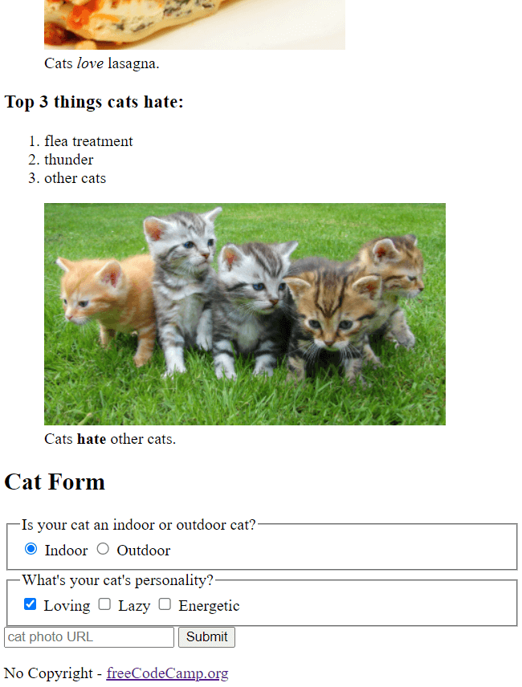

#### CSS Cafe Menu - [Live View](https://nostrand.github.io/responsive-web-design-fcc/css-cafe-menu/index.html)
Crafted a cafe menu page refining CSS techniques to control colors, fonts, sizes, and more for improved webpage presentation.

  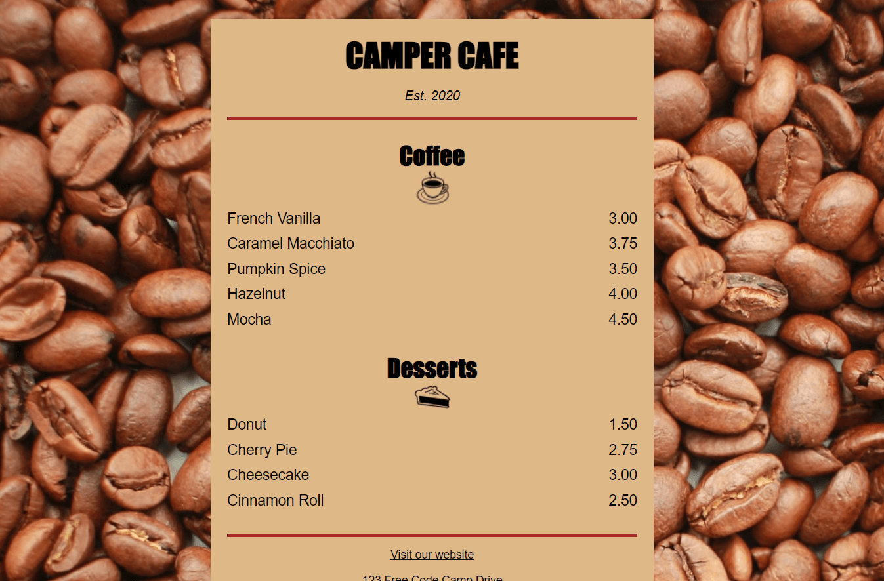

#### CSS Colored Markers - [Live View](https://nostrand.github.io/responsive-web-design-fcc/css-colored-markers/index.html)
Crafted a collection of colored markers, exploring various color values and combinations to enhance the visual appeal and design aesthetics of web elements.

  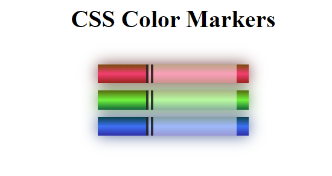

#### HTML Registration Form - [Live View](https://nostrand.github.io/responsive-web-design-fcc/html-registration-form/index.html)
Constructed a user-friendly registration form with HTML, delved into form control and data input personalization, integrating CSS styling for a visually appealing presentation.

  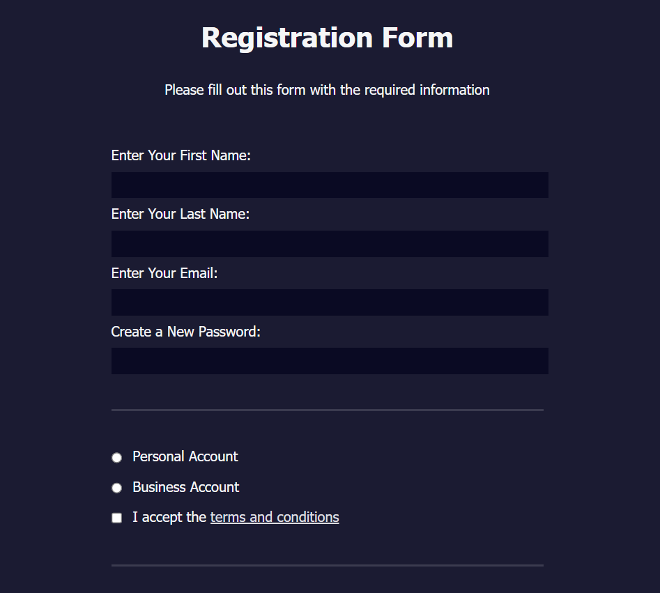

### Main Project - Survey Form - [Live View](https://nostrand.github.io/responsive-web-design-fcc/project-survey-form/index.html)
The goal of this project was to build a custom survey form, using HTML & CSS and apply the concepts covered in the previous mini-projects.

  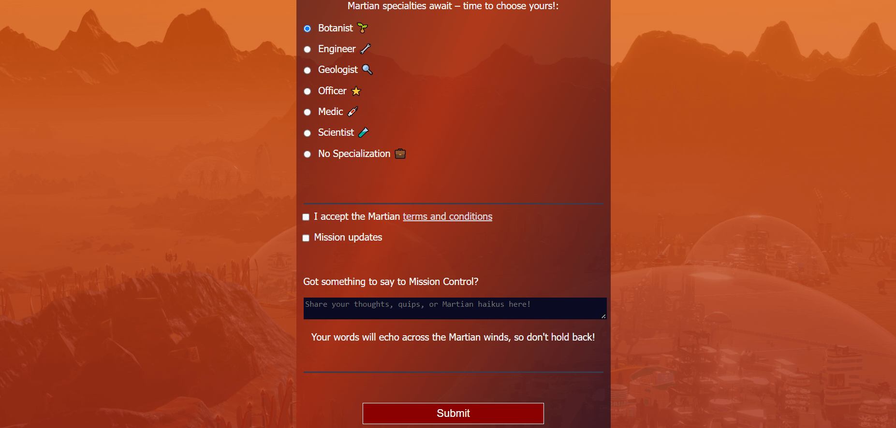

---

## Section 2
### Mini-Projects

#### CSS Box Model Art - [Live View](https://nostrand.github.io/responsive-web-design-fcc/css-rothko-painting/index.html)
Utilized CSS and the Box Model to craft Rothko-style rectangular art pieces.

  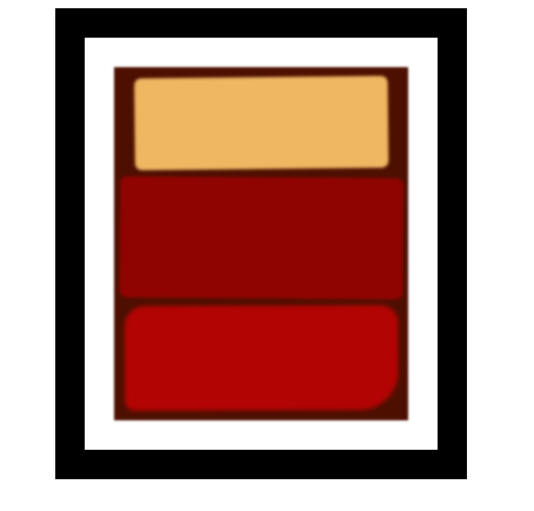

#### CSS Flexbox Gallery - [Live View](https://nostrand.github.io/responsive-web-design-fcc/css-flexbox-gallery/index.html)
Created a responsive photo gallery using CSS Flexbox, ensuring excellent visual presentation across various screen sizes.

  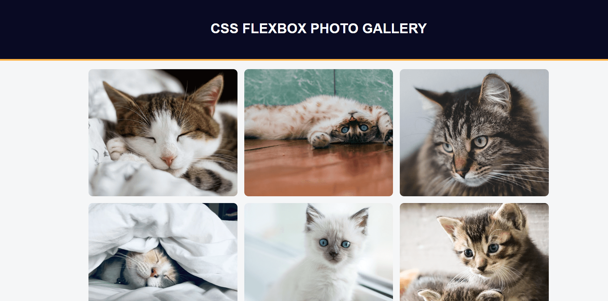

#### Nutrition Label - [Live View](https://nostrand.github.io/responsive-web-design-fcc/nutrition-label/index.html)
Used typography to build a nutrition label webpage. Leveraged CSS to enhance text styling, adjust line heights, and position content.

  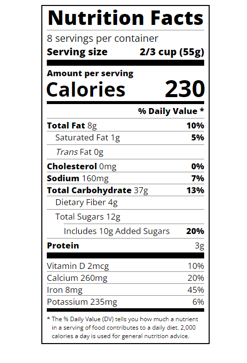

#### Accessibility Quiz - [Live View](https://nostrand.github.io/responsive-web-design-fcc/accessibility-quiz/index.html)
Created a quiz webpage with a focus on accessibility. Implementing keyboard shortcuts, ARIA attributes, and design best practices. 

  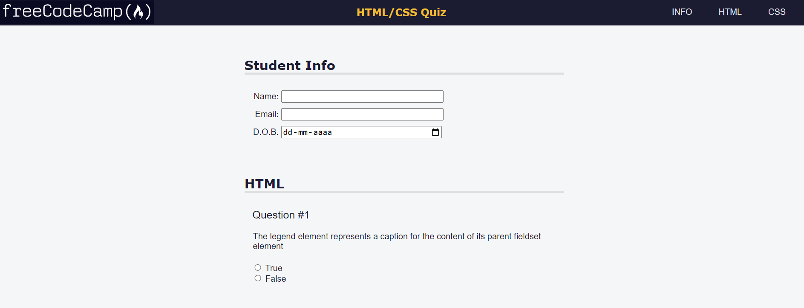

### Main Project - Tribute Page - [Live View](https://nostrand.github.io/responsive-web-design-fcc/project-tribute-page/index.html)
The goal of my project was to craft a Slam Tilt tribute page, using HTML & CSS, and apply the concepts covered in the previous mini-projects.

  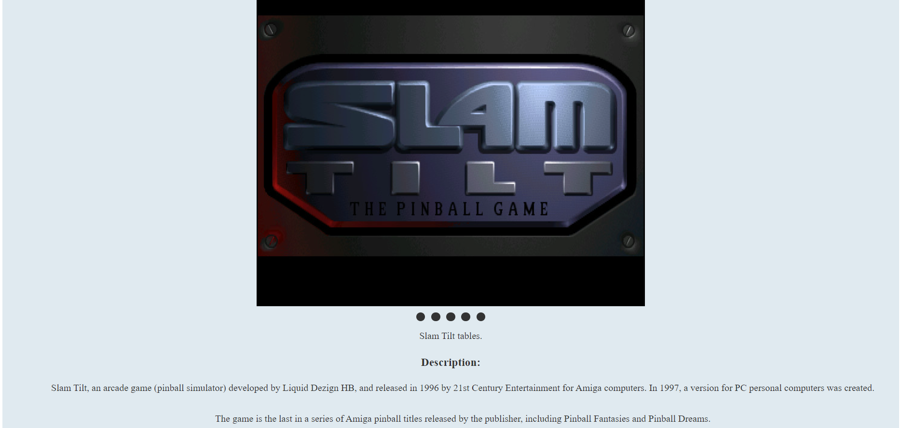

---

## Section 3
### Mini-Projects

#### Balance Sheet - [Live View](https://nostrand.github.io/responsive-web-design-fcc/balance-sheet/index.html)
Built a balance sheet using pseudo selectors. Applied hover effects and event triggers to enhance user experience. 

  

#### Cat Painting - [Live View](https://nostrand.github.io/responsive-web-design-fcc/cat-painting/index.html)
Created a quiz webpage with a focus on accessibility. Implementing keyboard shortcuts, ARIA attributes, and design best practices. 

  

#### Piano - [Live View](https://nostrand.github.io/responsive-web-design-fcc/piano/index.html)
Created a quiz webpage with a focus on accessibility. Implementing keyboard shortcuts, ARIA attributes, and design best practices. 

  

### Main Project - Technical Documentation Page - [Live View](https://nostrand.github.io/responsive-web-design-fcc/project-technical-documentation-page/index.html)
The goal of this project was to build a technical documentation page using only HTML & CSS. The page features a user-friendly navigation bar that seamlessly guides users to different sections, enhancing accessibility and ease of use.

  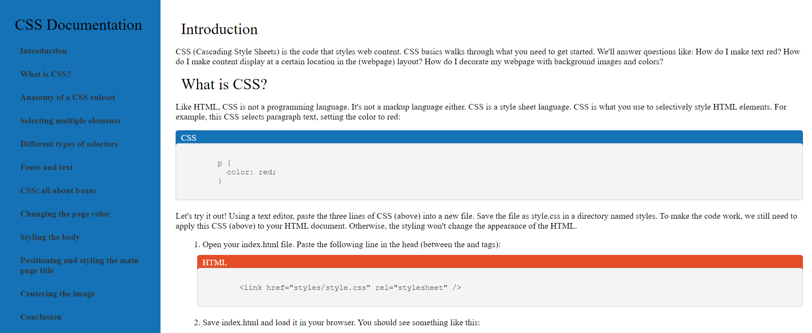

 -->

---

## Section 4
### Mini-Projects

#### City Skyline - [Live View](https://nostrand.github.io/responsive-web-design-fcc/city-skyline/index.html)
Crafted a dynamic city skyline using CSS variables for streamlined styling and reusability.

  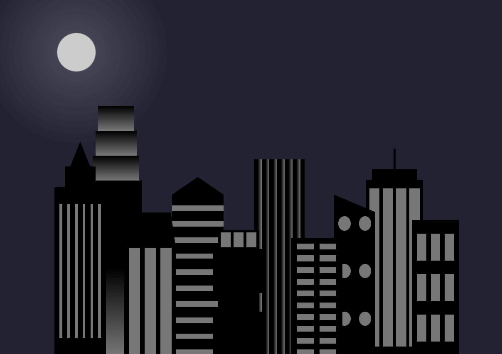

